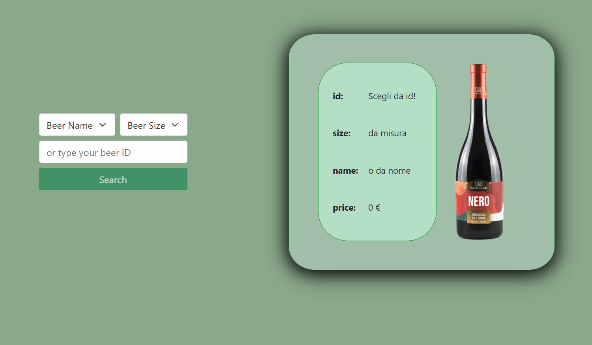

# FakeE-Shop

Didactic code useful for my first experiments with Angular 13, Typescript, reactive programming and rxjs, Reactive Forms Module with dynamic controls, services, fake server from json-server REST API, Http Client Module.

Setup:

- after cloning run `npm i` then once inside the folder type `json-server db.json` finally run with `ng serve -o`.

